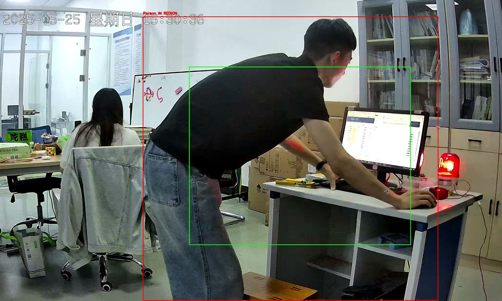
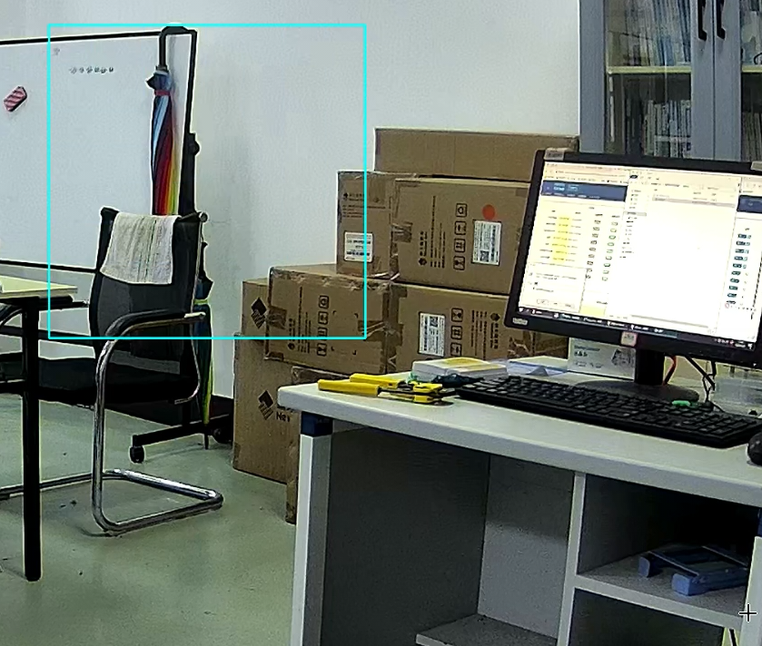
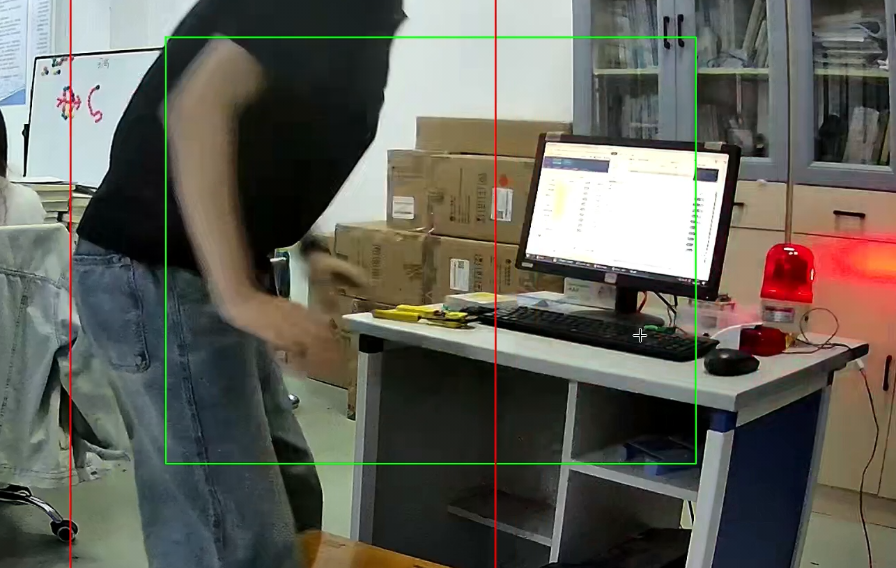
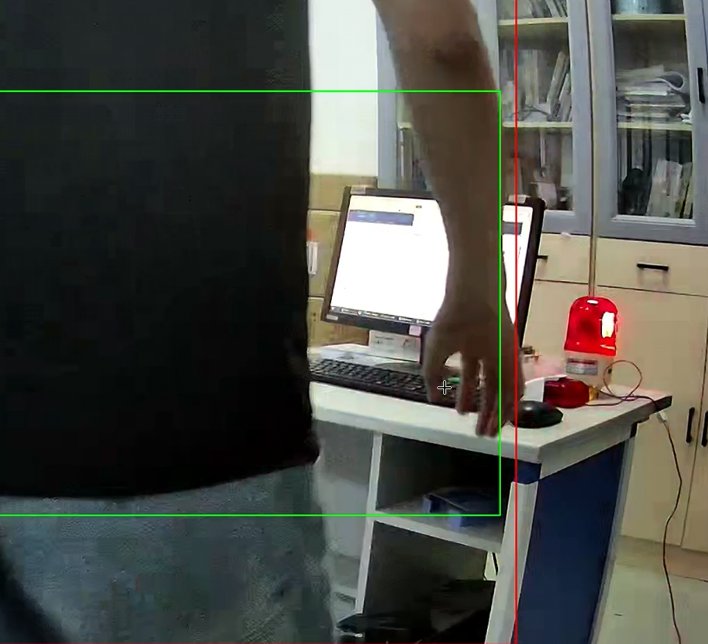

# 智能入侵检测系统

一个使用 RTSP 网络摄像头和 YOLOv8 模型进行目标检测的实时人体入侵检测系统。该系统监控视频流中的用户自定义区域，当检测到未经授权的人员存在时，通过新大陆物联网云平台触发报警。

---

## 🌐 项目概述

这个智能安防解决方案集成了计算机视觉和物联网技术，能够快速可靠地检测预定义区域内的入侵行为。特别适用于：

* 🏫 学校走廊或教室
* 🏭 工业区或工厂
* 🏢 办公楼或限制区域
* 🏘️ 住宅入口或楼梯间

### 🔧 系统工作流程

```
[RTSP网络摄像头] → [YOLOv8人体检测] → [检查自定义区域入侵] → [触发新大陆物联网报警设备]
                                               ↓
                                         [区域清空时自动关闭报警]
```

---

## ✨ 主要特点

* 🎥 实时 RTSP 流监控
* 🖱️ 基于鼠标的多区域绘制
* 👤 人体检测和区域入侵判断
* 📊 实时入侵统计和视觉反馈
* 🔔 新大陆物联网设备触发集成
* ⌛ 带防抖的自动关闭逻辑，减少误报
* 💡 智能灯光/报警集成与控制 API

---

## 🖥️ 系统要求

### 硬件要求

* Windows 10 或更高版本（Linux 需调整）
* 支持 RTSP 的网络摄像头
* 至少 4GB 内存（推荐 8GB 以上）
* 支持 CUDA 的 GPU（推荐用于流畅检测）

### 软件要求

* Python 3.8+
* CUDA 工具包（用于 GPU 加速）
* OpenCV、Ultralytics、PyQt5、Torch 等

---

## 🚀 安装步骤

```bash
# 1. 克隆项目
$ git clone https://github.com/MinManchiZ/Smart-Intrusion-Alarm.git
$ cd Smart-Intrusion-Alarm

# 2. 创建并激活虚拟环境
$ python -m venv venv
$ source venv/bin/activate  # Windows: venv\Scripts\activate

# 3. 安装依赖
$ pip install -r requirements.txt

# 4. 运行应用
$ python Waring.py
```

模型文件（`yolov8l.pt`）将在首次运行时自动下载。

---

## 🧑‍💻 使用说明

### 基本控制

* ▶️ 点击 `开始检测` 开始
* 🖱️ 使用鼠标左键绘制检测区域
* 🔁 按 `c` 清除所有区域
* 🔙 按 `z` 撤销上一个区域
* ⛔ 按 `ESC` 退出

### 智能检测逻辑

* 发生入侵：触发 API → 开启报警
* 人员离开：等待超时 → API → 关闭报警
* 所有操作都带有防抖控制，避免频繁切换

---

## 📂 项目结构

```
Smart-Intrusion-Alarm/
├── Waring.py            # 主应用程序 UI + 逻辑
├── newland_api.py       # 封装的物联网 API 调用
├── yolov8l.pt           # YOLO 模型（自动下载）
├── requirements.txt     # 核心 Python 依赖
├── build.py             # EXE 构建脚本
├── core/
│   ├── images/          # 截图、UI 元素
│   └── docs/            # 额外文档或配置文件
```

---

## 🧰 技术栈

* **计算机视觉**：YOLOv8 + OpenCV
* **UI 框架**：PyQt5
* **物联网集成**：新大陆云 API（HTTP）
* **后端逻辑**：Python 3.8+

主要 Python 包：

* `torch`、`ultralytics`、`opencv-python`
* `PyQt5`、`requests`、`numpy`

---

## 📷 项目预览

| 描述               | 预览                                       |
| ------------------------- | --------------------------------------------- |
| 主界面         |  |
| 工作站设置         |  |
| 物联网网关视图          |  |
| 报警灯设备        |  |
| 区域绘制模式         |  |
| 检测结果（激活） |  |
| 角度 B 检测结果    |  |

---

## 📦 从源码构建

### 开发环境设置

```bash
pip install -r requirements-dev.txt
python -m pytest tests/
```

### 生成可执行文件

```bash
python build.py
```

可执行文件将在 `/dist` 目录中生成。

---

## 🔧 性能调优

* 使用 GPU（CUDA）加速检测
* 降低模型分辨率以提高 FPS
* 调整 RTSP 流分辨率和帧率
* 确保稳定的局域网连接以减少视频延迟

---

## ❗ 故障排除

### 1. 没有摄像头画面？

* 检查 RTSP URL 语法和网络连接
* 确保摄像头可访问且已通电

### 2. 检测延迟或卡顿？

* 确保 CUDA 安装正确
* 尝试切换到较小的 YOLO 模型（如 `yolov8n.pt`）

### 3. 报警未触发？

* 验证 API 密钥和端点格式
* 确认新大陆物联网中的设备权限

---

## 🤝 贡献指南

我们欢迎社区贡献！

### 步骤

1. Fork 本仓库
2. 创建特性分支（`git checkout -b feature/foo`）
3. 提交更改（`git commit -am '添加 foo'`）
4. 推送到分支（`git push origin feature/foo`）
5. 提交 Pull Request

### 指南

* 遵循 PEP8 代码风格
* 编写文档字符串和单元测试
* 在 README 中记录新 API

---

## 📜 许可证

本项目采用 MIT 许可证。详见 `LICENSE` 文件。

---

## 🙌 致谢

* [Ultralytics YOLOv8](https://github.com/ultralytics/ultralytics)
* [新大陆物联网](https://www.nlecloud.com/)
* [OpenCV 团队](https://opencv.org/)

---

## 🚧 路线图（计划功能）

* [ ] 多摄像头流支持
* [ ] 移动应用推送通知
* [ ] Web 仪表板和控制面板
* [ ] 云事件存储和时间线
* [ ] 更智能的检测模式
* [ ] MQTT 协议支持
* [ ] 硬件看门狗和故障转移
